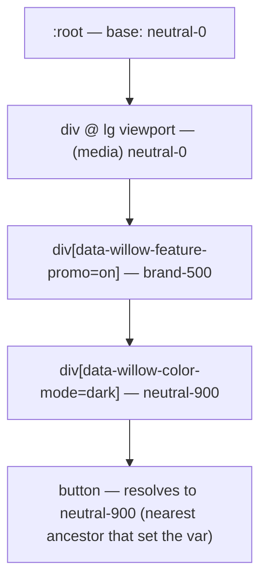

# Willow scope model

Tokens take different values depending on **scope**. A scope is a condition
under which a token resolves to an alternate value: a color mode, a viewport
breakpoint, or a feature. This document defines the v1 scope taxonomy, the
`data-willow-*` attribute contract the application uses to activate scopes, how
a token declares scope-specific values in the source, and — most importantly —
the precedence model that makes resolution deterministic when scopes nest in
any order.

This is a design specification. Authoring the `$scopes` shape and emitting the
CSS/JS artifacts are implemented by later tickets (the build pipeline, #6, and
the CSS/JS emit tickets, #7 and #8); the emitted CSS shown here is illustrative.
The companion authoring contract is [`docs/token-schema.md`](./token-schema.md).

## Scope taxonomy (v1)

| Scope type     | Values (v1)                                       | Activation         |
| -------------- | ------------------------------------------------- | ------------------ |
| **Color mode** | `light`, `dark`                                   | Attribute selector |
| **Breakpoint** | `sm`, `md`, `lg`                                  | Media query        |
| **Feature**    | Named flag/theme (`on`/`off` or a variant string) | Attribute selector |

- **Color mode** switches the palette. `light` is the base; `dark` (and any
  future modes) are overrides.
- **Breakpoints** are min-width thresholds. The base (unscoped) value applies
  below `sm`; each breakpoint widens from there. v1 thresholds:

  | Breakpoint | Min width |
  | ---------- | --------- |
  | `sm`       | `640px`   |
  | `md`       | `768px`   |
  | `lg`       | `1024px`  |

- **Features** are named, independently-togglable scopes for feature flags or
  sub-themes. Each feature has its own attribute so multiple features can be
  active at once. A feature value is either a boolean (`on`/`off`) or a named
  variant (e.g. `data-willow-feature-density="compact"`).

## The `data-willow-*` attribute contract

The application activates attribute-driven scopes by setting `data-willow-*`
attributes on any element. A scope applies to that element and everything it
contains (see [Precedence](#precedence-nesting-and-the-cascade)).

| Scope      | Attribute                    | Example                                 |
| ---------- | ---------------------------- | --------------------------------------- |
| Color mode | `data-willow-color-mode`     | `data-willow-color-mode="dark"`         |
| Feature    | `data-willow-feature-<name>` | `data-willow-feature-promo="on"`        |
| Feature    | `data-willow-feature-<name>` | `data-willow-feature-density="compact"` |

Rules:

- `<name>` is a lowercase, hyphenated segment (matching the token-path segment
  rules in the schema).
- Breakpoints intentionally have **no attribute** — they are viewport
  conditions, expressed as media queries, not DOM state.
- An attribute with no matching scoped tokens is inert (no error); it simply
  matches no override rules.
- Setting `data-willow-color-mode="light"` explicitly re-asserts the base mode,
  which is how a subtree opts back out of an ancestor's `dark`.

## Declaring scope-specific values in the source

A leaf token keeps its unscoped `$value` as the base and adds an optional
`$scopes` map. Each key is a **scope selector** — a `scope-type:value` string —
and each entry is a value (or [alias](./token-schema.md#aliases-references)) of
the same `$type` as the base token.

```ts
// Extends the leaf shape in `src/tokens/schema.ts`.
{
  $type: "color",
  $value: ref("color.neutral.0"),        // base (light)
  $scopes: {
    "color-mode:dark": ref("color.neutral.900"),
    "breakpoint:lg": "#ffffff",
    "feature-promo:on": ref("color.brand.500"),
  },
}
```

Scope selector grammar:

| Scope type | Selector key form        | Example            |
| ---------- | ------------------------ | ------------------ |
| Color mode | `color-mode:<value>`     | `color-mode:dark`  |
| Breakpoint | `breakpoint:<value>`     | `breakpoint:md`    |
| Feature    | `feature-<name>:<value>` | `feature-promo:on` |

Constraints (enforced by the build, alongside the existing schema validations):

- A scoped value's `$type` matches the base token's `$type`.
- Aliases in `$scopes` resolve and type-match exactly like base aliases.
- Scope selector keys reference known scope types and use permitted segment
  characters.

Because the base value stays on the token, a token is **fully defined without
any scope** — scopes are purely additive overrides. This keeps the tree
serialization-agnostic for the planned iOS export.

## How scopes map to CSS

Each scope type maps to the CSS construct that best expresses its activation
condition:

| Scope type | CSS construct      | Why                                          |
| ---------- | ------------------ | -------------------------------------------- |
| Color mode | Attribute selector | DOM state, can nest per-subtree              |
| Feature    | Attribute selector | DOM state, independently togglable, can nest |
| Breakpoint | Media query        | Viewport condition, not DOM state            |

The build emits a `:root` base layer plus one override rule per scoped value.
Attribute scopes become attribute selectors; breakpoints wrap declarations in a
`@media (min-width: …)` block. For the token above:

```css
:root {
  --willow-color-background-primary: var(--willow-color-neutral-0);
}

[data-willow-color-mode="dark"] {
  --willow-color-background-primary: var(--willow-color-neutral-900);
}

[data-willow-feature-promo="on"] {
  --willow-color-background-primary: var(--willow-color-brand-500);
}

@media (min-width: 1024px) {
  :root {
    --willow-color-background-primary: #ffffff;
  }
}
```

## Precedence: nesting and the cascade

**Requirement:** scopes may nest in any DOM order, and the most-nested (deepest)
applicable scope wins — deterministically, regardless of the order the scopes
are nested in.

**Mechanism: custom-property inheritance, not selector specificity.** Each scope
override re-declares the affected `--willow-*` custom property _on the scoping
element itself_. CSS custom properties inherit, so any element resolves a
variable to the value set by its **nearest ancestor** that declared it. The
deepest scope in the DOM is, by definition, the nearest ancestor — so it wins
automatically. This is ordinary inheritance and does not depend on the
specificity or source order of the scope selectors, which is exactly what makes
nesting order-independent.



Contrast with specificity: if precedence relied on selector specificity,
`[data-willow-color-mode="dark"]` and `[data-willow-feature-promo="on"]` have
_equal_ specificity, so the winner would depend on source order in the
stylesheet — not on which is deeper in the DOM. Inheritance sidesteps this
entirely: the value that reaches a node is always the one from the closest
enclosing scope element.

### Same-element conflicts

Inheritance resolves _across_ elements (depth). When two attribute scopes set
the **same** variable on the **same** element (e.g. one `<div>` carries both
`data-willow-color-mode="dark"` and `data-willow-feature-promo="on"`), there is
no depth to distinguish them. This is the one case decided by the normal
cascade: equal-specificity attribute selectors resolve by **source order**, and
the build emits scope rules in a **fixed, documented order** so the outcome is
still deterministic.

v1 same-element order (later rule wins): **color mode → feature**. A feature
override therefore beats a color-mode override on the same element. To force the
opposite, place the scopes on separate nested elements, where depth (not order)
decides.

Breakpoint media queries are emitted after the base but their declarations
target `:root`/scope elements; a breakpoint value set on an ancestor still loses
to an attribute scope set on a deeper descendant, because inheritance resolves
by depth first.

## Worked examples

### 1. Dark inside a feature inside a breakpoint

```html
<html data-willow-color-mode="light">
  <!-- viewport ≥ 1024px, so breakpoint:lg is active -->
  <body>
    <section data-willow-feature-promo="on">
      <div data-willow-color-mode="dark">
        <button>Buy</button>
      </div>
    </section>
  </body>
</html>
```

Resolving `--willow-color-background-primary` on `<button>`, using the token
defined above:

| Ancestor (outer → inner)           | Sets var to             |
| ---------------------------------- | ----------------------- |
| `:root` (base) + `@media lg`       | `neutral-0` / `#ffffff` |
| `[data-willow-feature-promo="on"]` | `brand-500`             |
| `[data-willow-color-mode="dark"]`  | `neutral-900`           |

The nearest ancestor that sets the variable is the `dark` `<div>`, so the button
resolves to **`neutral-900`**.

### 2. Order-independence

Swap the nesting so the feature is the deepest scope:

```html
<div data-willow-color-mode="dark">
  <section data-willow-feature-promo="on">
    <button>Buy</button>
  </section>
</div>
```

Now the nearest ancestor setting the variable is the `feature-promo` `<section>`,
so the button resolves to **`brand-500`**. Only the DOM depth changed — no
stylesheet edit, no specificity tweak — and the result flips accordingly. This
is the deterministic "deepest wins" behavior.

### 3. Same-element tie-break

```html
<div data-willow-color-mode="dark" data-willow-feature-promo="on">
  <button>Buy</button>
</div>
```

Both scopes are on one element, so there is no depth to compare. The fixed emit
order (color mode → feature, feature last) means the **feature** value wins:
the button resolves to **`brand-500`**. Splitting the attributes onto nested
elements (example 1 vs 2) is how an author chooses a different winner.

## Determinism summary

- Across elements, precedence is decided by **DOM depth** via custom-property
  inheritance: the deepest applicable scope always wins, independent of nesting
  order or stylesheet source order.
- On a single element, precedence is decided by a **fixed, documented emit
  order** (color mode → feature), so the result is still deterministic.
- Breakpoints participate as inherited values set by media queries and are
  subject to the same depth-based resolution.

Given a DOM and a viewport, every `--willow-*` variable resolves to exactly one
value with no ordering ambiguity.

## Considered and rejected: CSS `light-dark()`

CSS `light-dark()` expresses a light/dark pair inside a single value
(`color: light-dark(black, white)`), switched by the `color-scheme` property. It
was evaluated and **rejected** as the scope mechanism because:

- **Color-mode only.** It cannot express breakpoints or features, so it would
  cover just one of three scope types and force a second, different mechanism
  for the rest — the opposite of a uniform model.
- **No depth-based precedence.** It resolves per value, not per scope element,
  so it does not provide the "deepest-nested scope wins in any order" behavior
  the attribute + inheritance model gives.
- **Opt-in coupling.** It requires the page to set `color-scheme`, coupling
  token resolution to a property consumers must manage separately.

Standardizing every scope type on the attribute-selector + custom-property
inheritance model keeps one consistent, order-independent precedence rule for
color modes, breakpoints, and features alike.
